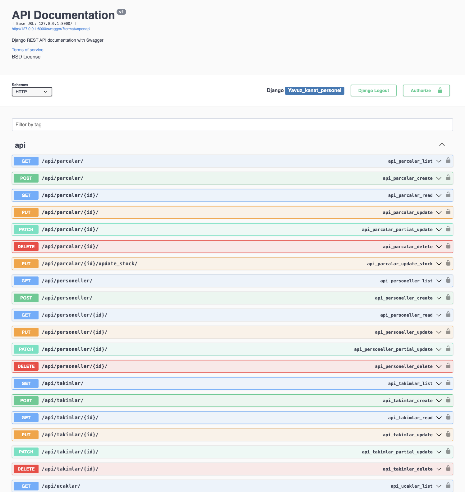

# Part Production and Assembly Management System

This project is designed to streamline the management of part production and assembly in an aerospace manufacturing environment. It allows production teams to create only the parts they are responsible for, while the assembly teams can combine parts to produce aircraft.

## Features

- **Part Management**
  - Production teams can only produce parts within their responsibilities.
  - Manage stock levels, with options to reduce or view current stock.
  - Missing parts and out-of-stock items are flagged as "missing."

- **Assembly Management**
  - Assembly teams can combine parts to build aircraft.
  - Missing or incorrect parts are flagged with detailed notifications.

- **Authorization**
  - Team members can only perform tasks appropriate to their roles.
  - Assembly teams can view all parts but cannot produce new parts.

- **Dynamic Notifications**
  - Users receive real-time notifications about success or errors during operations.

- **Responsive User Interface**
  - A modern, responsive interface designed for intuitive user interaction.

## Setup Instructions

### 1. Install Dependencies
Install all necessary dependencies using the following command:
```bash
pip3 install -r requirements.txt
```

### 2. Configure the Database
Apply migrations to set up the database schema:
```bash
python3 manage.py makemigrations
python3 manage.py migrate
```

### 3. Start the Development Server
Launch the local server to test the application:
```bash
python3 manage.py runserver
```

### 3.1. Unit tests

```bash
python3 manage.py test
```

### 4. Access the Application
Navigate to `http://127.0.0.1:8000/` in your web browser to use the system.

## Usage Instructions

### 1. Login
Each team member logs in with their unique credentials.

### 2. Part Production
Production teams can use the provided form to produce parts they are authorized to create.

### 3. Stock Management
Stock levels can be reduced, and out-of-stock items will be flagged in real time.

### 4. Aircraft Assembly
Assembly teams can use existing parts to build aircraft. The system validates the parts and notifies users of any issues, such as missing or incorrect parts.

## Project Structure

```plaintext
hava_araci/
│
├── hava_araci/
│   ├── __init__.py
│   ├── asgi.py
│   ├── settings.py      # Django settings
│   ├── urls.py          # URL configuration
│   ├── wsgi.py
│
├── uretim/
│   ├── migrations/      # Database migrations
│   ├── static/          # Static files (CSS, JavaScript, etc.)
│   ├── templates/       # HTML templates
│   │   └── dashboard.html
│   ├── admin.py         # Admin site customization
│   ├── apps.py          # App configuration
│   ├── models.py        # Database models
│   ├── serializers.py   # API serializers
│   ├── tests.py         # Unit tests
│   ├── urls.py          # App-level URL configuration
│   ├── views.py         # View functions and API logic
│
├── Dockerfile           # Docker configuration
├── docker-compose.yml   # Docker Compose setup
├── manage.py            # Django management tool
├── requirements.txt     # Python dependencies
└── README.md            # Project documentation
```

## Screenshots

### Login


### Part Production Form


### Missing and Incorrect Parts Notification


### Missing and Incorrect Parts Notification 2


### Swagger


## Video Tutorial

- **Video Link:** [Watch on YouTube](https://www.youtube.com/watch?v=p8JOwtVOkFU)

## Contribution Guidelines

To contribute to the project, follow these steps:
1. Fork the repository.
2. Create a new branch for your feature:
   ```bash
   git checkout -b new-feature
   ```
3. Commit your changes:
   ```bash
   git commit -m "Add a new feature"
   ```
4. Push to your branch:
   ```bash
   git push origin new-feature
   ```
5. Open a pull request.

## License
This project is licensed under the MIT License. See the `LICENSE` file for details.
